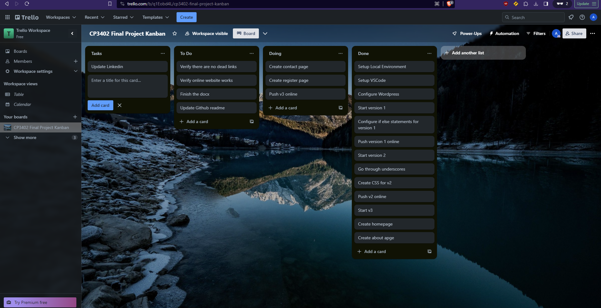
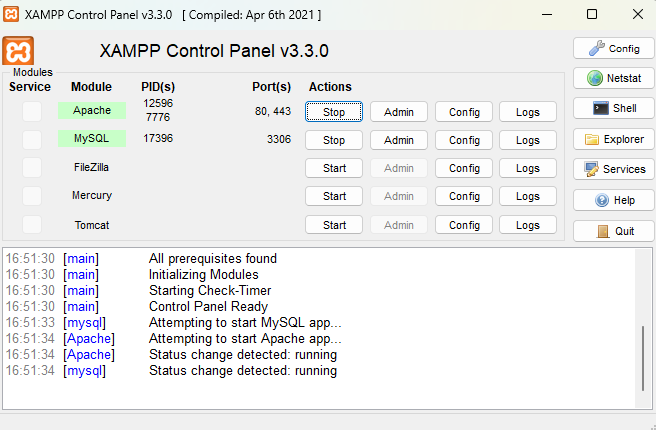

# CP3402 Assignment 2 PB Group 6

## Overview and Goals
The objective of this project is to develop a theme and website for JCU Open House, with the primary goals of boosting open house attendance by 5% and increasing the number of applicants by 10% by the project's completion before January 14, 2024. The overarching aim is to create an engaging online platform that effectively promotes the university's offerings and encourages active participation and interest from prospective attendees and applicants.

## Final Website
Link to the website: https://jcu.kanmari.online 

This website comprises five main pages, each serving a distinct purpose. The Home page serves as the central hub, featuring essential information about the open house, including the schedule table, details about Admission Question Day, and a convenient registration section. The Schedule page provides a detailed agenda for the event, highlighting various activities and programs scheduled from 12 pm to 5 pm. 

The About Us page is dedicated to presenting comprehensive information about JCU, offering insights into why prospective attendees should consider choosing JCU for their academic journey. Meanwhile, the Contact Us page serves as a platform for user interaction, featuring a user-friendly form for inquiries and providing contact details for JCU. Lastly, the Register Now page streamlines the registration process, offering a dedicated space for individuals to secure their spot at the open house event. Together, these pages aim to deliver a seamless and informative experience for visitors interested in JCU's open house.

Home page \
 

Schedule page \

About us page \
 

Contact us page \
 

Register form page \

## Communication
Due to the other team member being absent, this project was done alone by Abhi. Because of this there is no evidence of communication, since it was not needed.

## Project Management
I used the trello board to organise tasks and tackle them one by one, this organisation was helpful as it enabled me to break down the project into smaller tasks\
Trello link: https://trello.com/b/q1Eobd4L/cp3402-final-project-kanban\

## Deployment Tools
For local deployment, XAMPP was my chosen tool. Its open-source nature and user-friendly interface made it the ideal solution. Starting Apache for the website and MySQL for the database was a straightforward process, as illustrated in the screenshot of the XAMPP control panel below. This streamlined control panel allowed easy start and termination of the required Apache and MySQL services for local deployment.

For hosting deployment, Namecheap was my preferred choice for several reasons. It offered cost-effective solutions, and having an existing domain with Namecheap made the hosting process more convenient. The reliability of Namecheap, demonstrated by its consistent uptime, further contributed to its selection for hosting the website. In addition, its popularity meant that it was trivial to find solutions for problems that arose with setup of the website online.

## Development Tools
I used VSCode with relevant PHP extensions to code throught the project, this included both PHP and CSS for the themes

## Milestones
There are three versions available in this repository, each in a separate file. The first version is created to check the PHP plugin setup, containing simple code to ensure the correct configuration of PHP in VS Code. In this instance, XAMPP is used for deployment. The image below displays the code and the appearance of the initial version. \

The second version is built on a blank theme from Underscore. This theme offers the essential foundation required for a theme, serving as a valuable starting point for shaping our own theme and the website's content in our third version. During this phase, we also incorporate VVV. Testing for this version aids in configuring VVV. The screenshot below illustrates the code and the appearance of the second version in local deployment using VVV. \

The third and final version represents the conclusion of this project. Starting with the Underscore theme as the foundation, we developed the theme by incorporating additional code. The content was added later, once the theme was completed. The image below provides a snapshot of the appearance and code of the third version. \

## Workflow
The flowchart below showcases my workflow strategy for the project, it is quite simply, code, test, deploy, verify, and repeat

## Conclusion
At the project's beginning, I acquainted myself with the project's requirements, exchanged contact information, and set up communication groups and a Trello board. I established the project goal and configured the initial environment by installing the PHP plugin for VS Code and ensuring XAMPP was ready. I created the first version for testing the PHP plugin using XAMPP. If issues arose, I iteratively modified and retested until it functioned correctly. After successful PHP plugin tests, I transitioned to the Underscore theme, downloaded and set it up. Concurrently, I introduced VVV for local development, replacing XAMPP for testing the second version. Employing an iterative approach inspired by agile methodologies, I continuously tested and refined the code. 

Upon completing meticulous theme development, I shifted focus to content creation, conducting ongoing tests to maintain quality. Once both the theme and content were finalized, I seamlessly hosted the website on NameCheap, leveraging its reliability and my prior domain bought with Namecheap.
